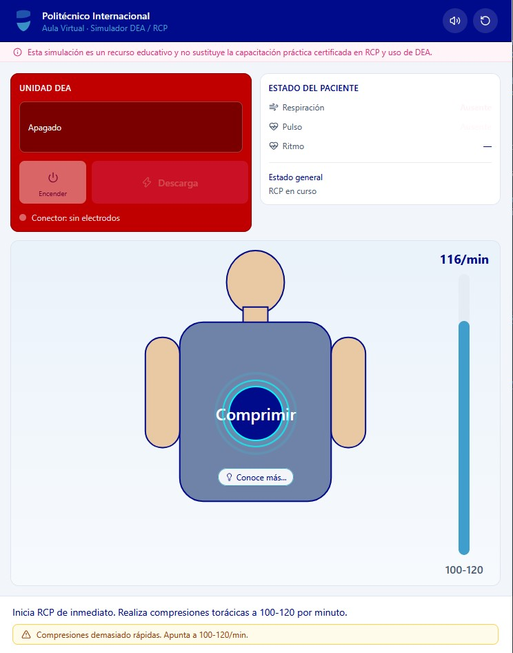

# 🩺 Simulador DEA-RCP

## 📌 Descripción

Componente interactivo construido con IA, en React (AEDSimulator.jsx) que implementa un simulador educativo de RCP (Reanimación Cardiopulmonar) y uso de DEA (Desfibrilador Externo Automático) para la plataforma de educación virtual del Politécnico Internacional.

Sí, puedo editarlo y modificarlo completamente según las características o cambios que necesites.

¿De qué se trata el simulador?

Contiene toda la lógica, interfaz y mecánicas de una práctica médica simulada paso a paso:

Secuencia clínica completa: Guía al estudiante por la verificación de escena segura, comprobación de respuesta/respiración, llamada a emergencias, ciclos de compresiones y ventilaciones, y uso del DEA.

Uso del DEA y ritmos aleatorios: Simula la detección automática de ritmos cardíacos (desfibrilables vs. no desfibrilables) elegidos al azar, evaluando si el usuario aplica la descarga o continúa RCP.

Mecánicas interactivas:

Arrastrar y soltar (drag and drop) los electrodos y la mascarilla de ventilación a sus posiciones correctas sobre el paciente.

Ritmo de compresiones en tiempo real (mide si los clics del usuario se mantienen en el rango objetivo de 100-120 compresiones por minuto).

Feedback educativo: Narración por voz mediante síntesis de audio (SpeechSynthesis), detección de errores críticos (como tocar al paciente mientras el DEA analiza) y ventanas informativas ("Conoce más...").

## 🛠️ Tecnologías utilizadas

- ReactJS

## 📸 Capturas de pantalla

## 🚀 Demo en vivo

👉 [Ver proyecto en GitHub Pages](https://ivan-develops.github.io/SimuladorDEA-RCP/)
